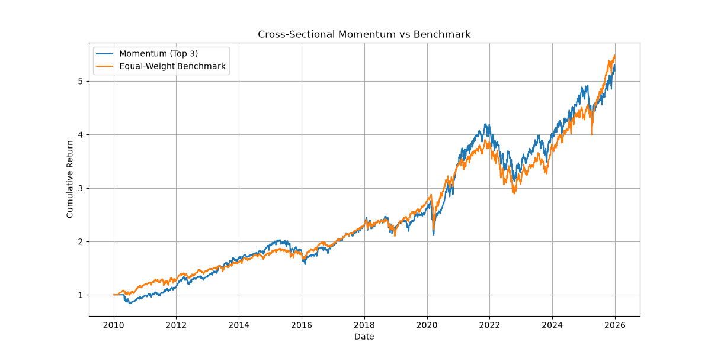
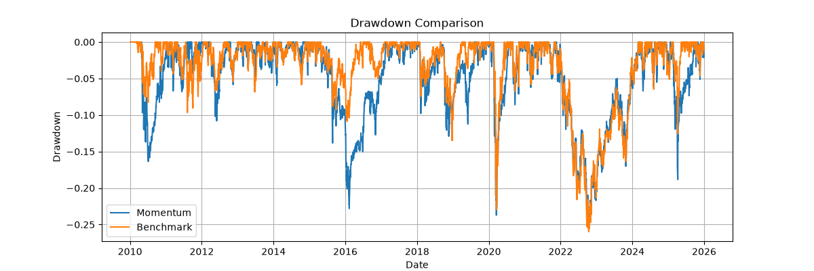
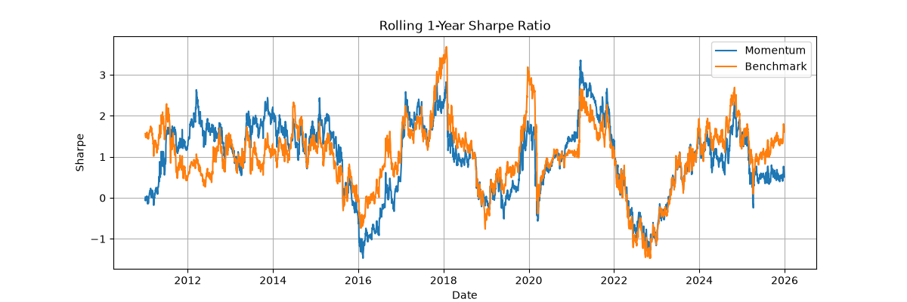
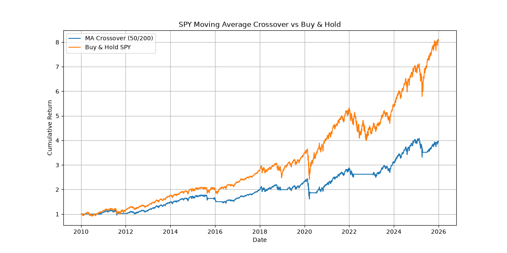

# ETF Momentum Backtest

## Overview
This project backtests a monthly cross-sectional momentum strategy on a universe of 6 liquid ETFs from 2010 to 2025. The strategy ranks ETFs by their past 60-day return and holds the top 3 with equal weight for one month. It also includes a simple moving-average crossover as a warm-up and an equal-weight benchmark for comparison.

## Data
- Source: Yahoo Finance via `yfinance`
- Tickers: SPY, QQQ, IWM, TLT, GLD, EFA
- Adjusted close prices, daily frequency
- Missing values forward-filled and dropped

## Methodology
1. Compute 60-day returns for each asset.
2. At each month-end, rank assets by past return.
3. Select top 3 and allocate equal weight.
4. Rebalance monthly; positions shifted by one day to avoid look-ahead bias.
5. Compare against equal-weight buy-and-hold benchmark (monthly rebalanced).
6. Performance metrics: annualised return, volatility, Sharpe ratio, max drawdown, rolling Sharpe.

## Results

| Metric               | Momentum (Top 3) | Equal-Weight Benchmark |
|----------------------|------------------|------------------------|
| Annualised Return    | 10.87%           | 11.18%                 |
| Sharpe Ratio         | 0.81             | 0.922                  |
| Maximum Drawdown     | -25.60%          | -25.98%                |

*Note: Replace example values with your actual benchmark metrics. You can find them by running `python main.py` and reading the printed table.*

### Equity Curve

### Drawdown

### Rolling 1-Year Sharpe Ratio

### Single-Asset Moving Average Crossover (SPY)

## Project Structure
- `data.py` – downloads and cleans ETF data
- `strategies.py` – signal generation (moving average crossover, momentum signals)
- `backtest.py` – converts monthly weights to daily positions, calculates portfolio returns
- `metrics.py` – performance metrics (annualised return, volatility, Sharpe, max drawdown, rolling Sharpe)
- `main.py` – runs the full backtest and generates plots
- `plots/` – output images

## Limitations
- No transaction costs or slippage modelled.
- Survivorship bias in chosen ETFs.
- Short lookback period not optimised.
- Risk-free rate assumed zero.

## How to Run
pip install -r requirements.txt
python main.py
